# FlowForge AI: Enterprise Workflow Automation Platform

[](https://github.com/faizanaziz21/AI-Workflow-Automation/actions/workflows/ci.yml)

FlowForge AI is a self-hostable, multi-tenant workflow automation platform in the spirit of n8n, Zapier and
Temporal, built for operations teams that need **AI in the loop, humans in the loop, and an audit trail for
both**. Teams design workflows on a visual canvas. A durable PostgreSQL-backed engine runs them with retries,
timeouts, approvals and crash recovery. Every step can be inspected, replayed and audited.

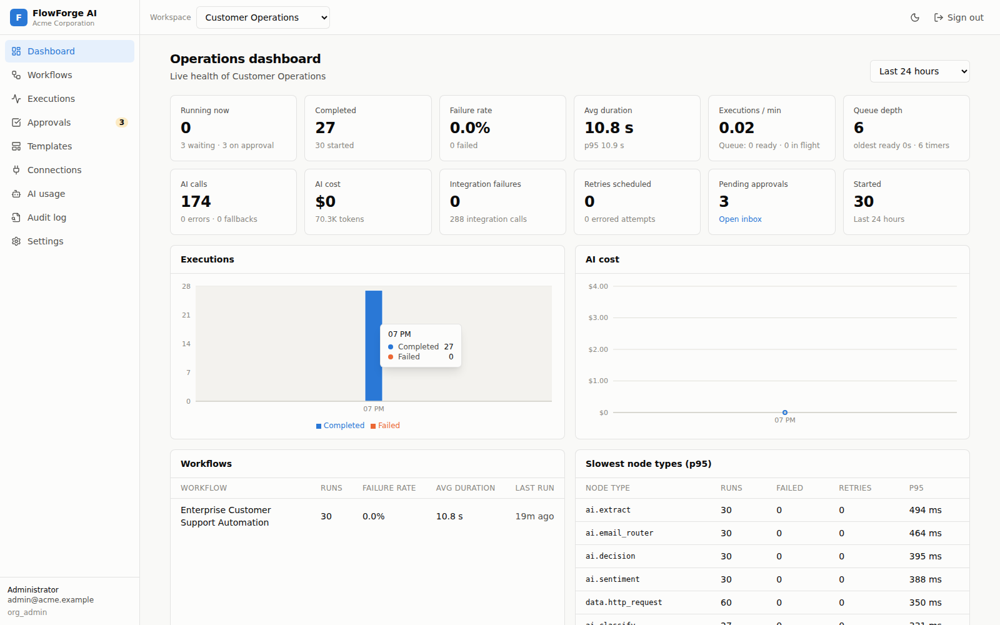

<table>
<tr>
<td>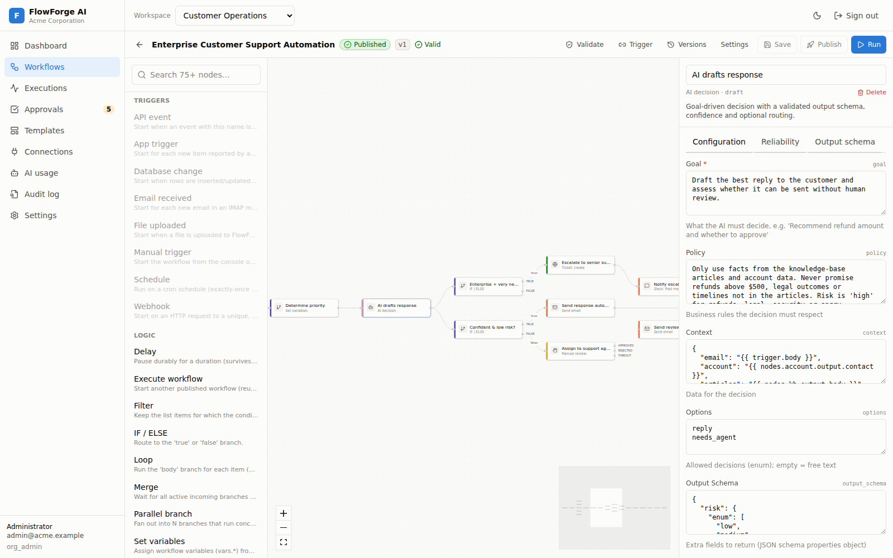<br/><sub><b>Visual editor</b>: 76 node types, schema-driven configuration, live validation</sub></td>
<td>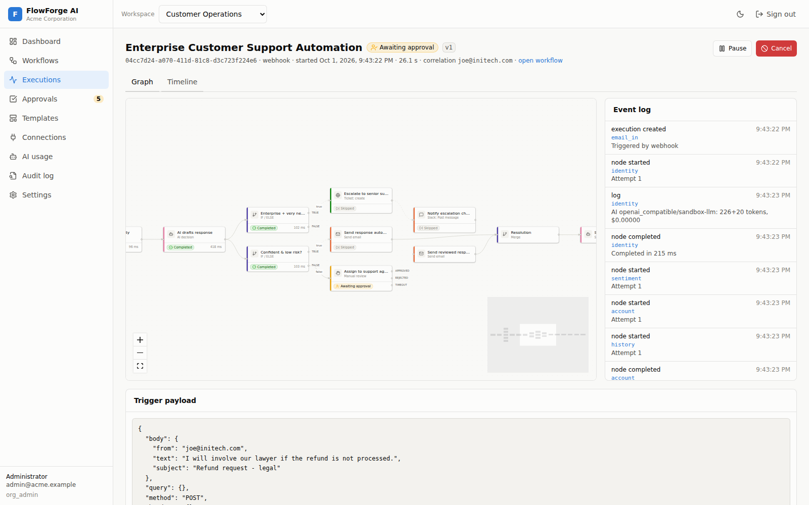<br/><sub><b>Execution inspector</b>: per-node input/output, attempts, retry, replay</sub></td>
</tr>
<tr>
<td>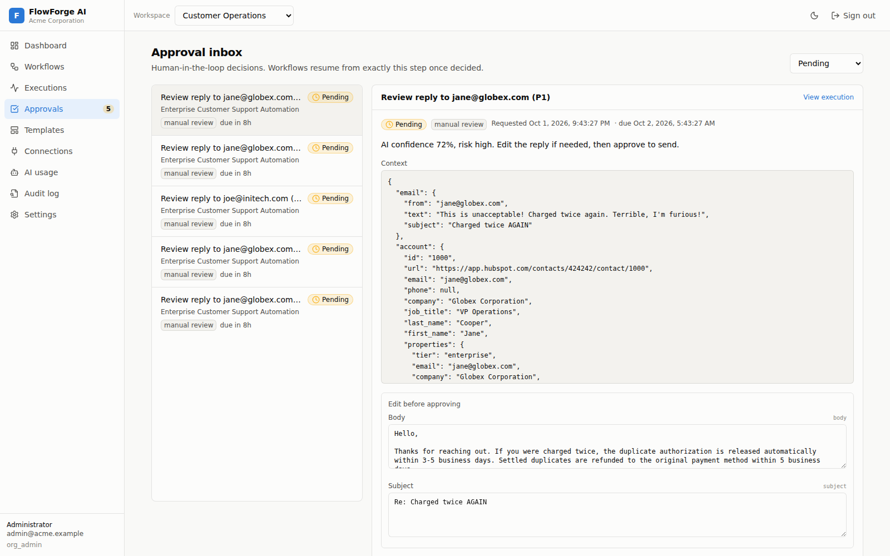<br/><sub><b>Human-in-the-loop</b>: approvals, reviews, escalation, deadlines</sub></td>
<td>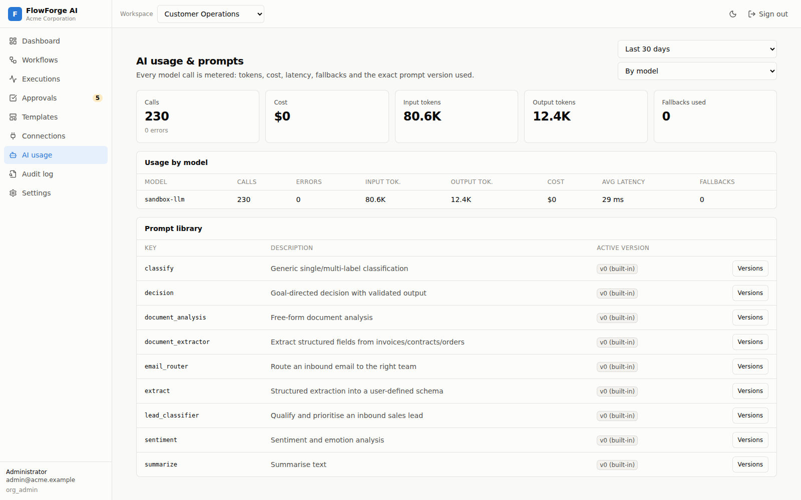<br/><sub><b>AI layer</b>: provider-neutral, schema-validated, token and cost tracking</sub></td>
</tr>
<tr>
<td>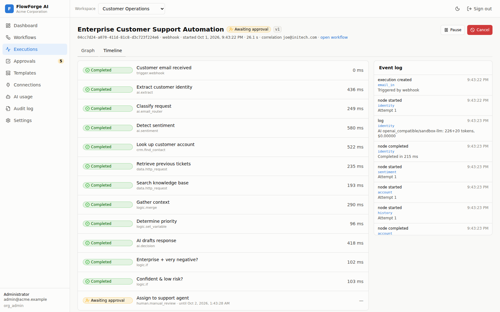<br/><sub><b>Timeline</b>: every state transition, retry and signal</sub></td>
<td>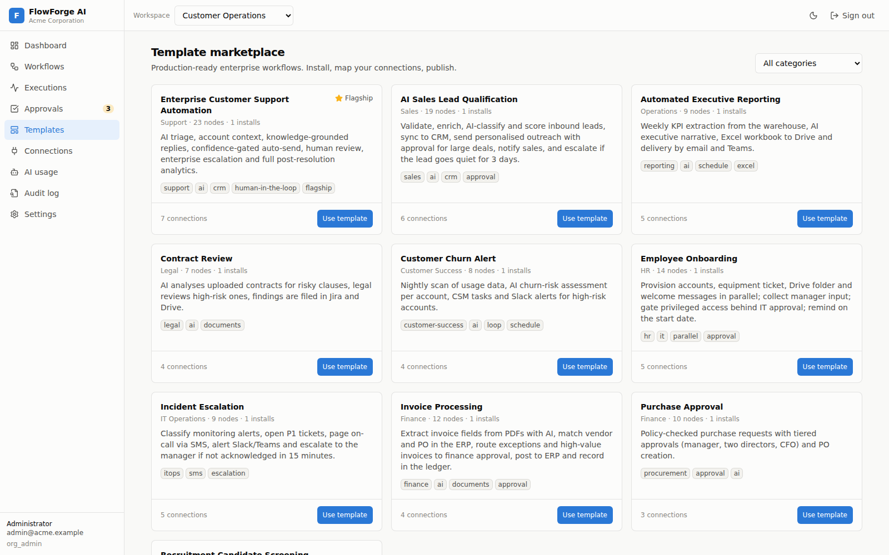<br/><sub><b>Templates</b>: 10 production-shaped automations</sub></td>
</tr>
<tr>
<td>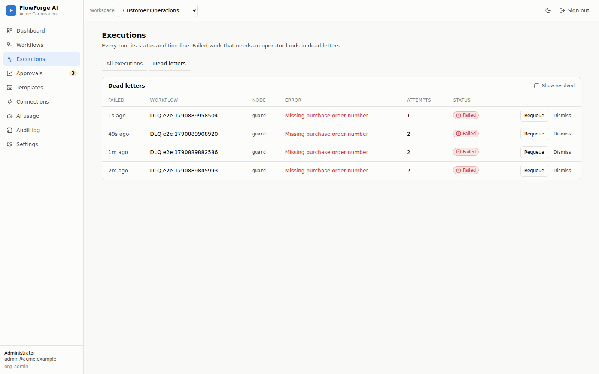<br/><sub><b>Dead letters</b>: failed work an operator can requeue</sub></td>
<td>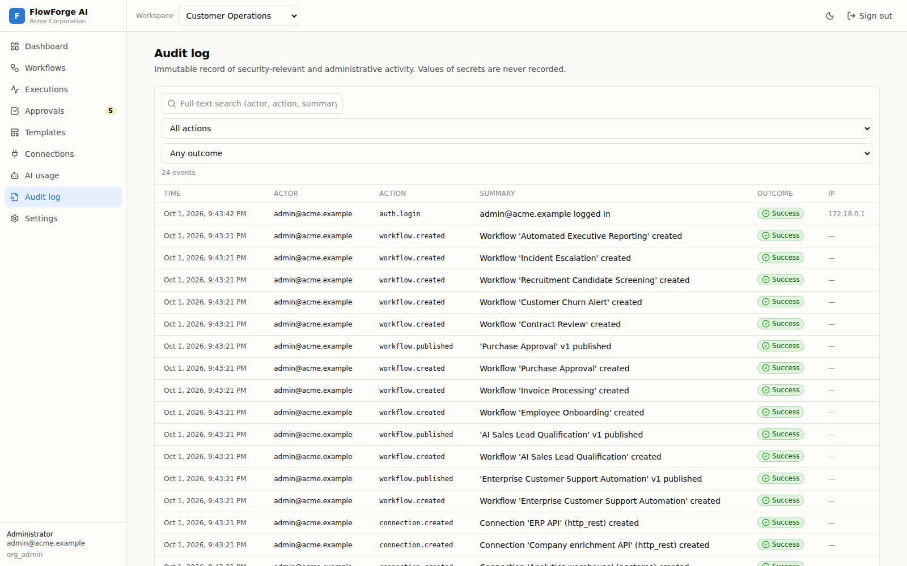<br/><sub><b>Audit log</b>: full-text search over security-relevant activity</sub></td>
</tr>
</table>

## Highlights

* **Durable execution engine.** State and the job that continues it commit in one PostgreSQL transaction. Workers
  claim with `SKIP LOCKED` under leases and heartbeats. Retries use jittered exponential backoff, with per-node
  timeouts, idempotency keys, durable timers, signals, sub-workflows and loops. Operators get cancel, pause,
  resume, partial retry, node replay and dead letters. Killing a worker mid-node loses nothing.
* **Human-in-the-loop.** Approval, manual-review and request-info nodes with approver users, teams or roles,
  n-of-m quorum, separation of duties, escalation chains, deadlines with timeout branches, comments and a full
  decision history. A paused workflow costs a row, not a thread.
* **Provider-neutral AI layer.** OpenAI, Anthropic, Gemini and any OpenAI-compatible endpoint (Ollama, vLLM)
  behind one gateway with JSON-schema enforcement, automatic repair turns, fallback models, versioned prompts,
  and per-call token and cost accounting. Reusable components: lead classifier, email router, document
  extractor, AI decision with confidence-gated routing.
* **Integrations.** A connector SDK (Pydantic models + `@action`/`@trigger` decorators, OAuth 2.0 + PKCE,
  plugin entry points) with 13 business connectors and 4 AI providers. Provider-neutral capability nodes mean you
  can swap HubSpot for Pipedrive, or Twilio for Vonage, by changing a connection.
* **Enterprise security.** Multi-tenant orgs, workspaces and teams; six roles with workspace scoping;
  Argon2id; rotating refresh tokens with reuse detection; API keys; envelope-encrypted credentials with KEK
  rotation; secret masking by key, value and pattern; SSRF egress policy; signed webhooks; a sandboxed expression
  language; rate limiting; searchable audit log.
* **Operable.** Prometheus metrics with alert rules, a Grafana dashboard, OpenTelemetry traces, structured logs,
  health probes, Docker Compose, Kubernetes manifests with HPAs on queue depth, and CI with E2E tests.
* **Load-tested.** A harness drives 100 users, 500 workflows and thousands of executions through the public
  API, including webhook bursts and injected API and LLM failures. It found and fixed real concurrency bugs (see
  [Benchmarks](#benchmarks)).

## Architecture

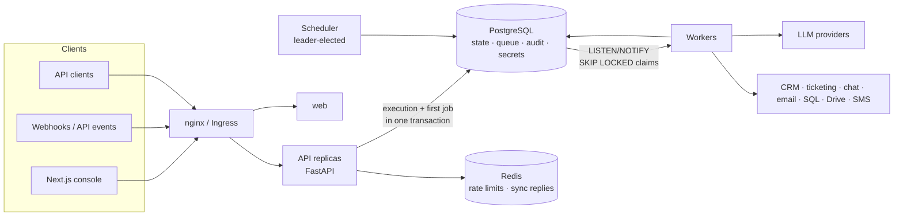

Execution model: an `execution.advance` job computes which nodes are runnable (with dead-path elimination for
branches) and enqueues `node.run` jobs. Each `node.run` claims its node, runs the handler with a timeout and an
idempotency key, then **persists the result, enqueues the next advance and deletes its own job in one commit**.
Waits, approvals and retries are future-dated jobs, so they consume no worker capacity.

More: [Architecture](docs/ARCHITECTURE.md) · [Workflow engine](docs/WORKFLOW_ENGINE.md) ·
[Design plan and ADRs](docs/PLAN.md)

## Sample workflow: Enterprise Customer Support Automation

The flagship template (23 nodes) turns an inbound support email into a resolved, documented ticket:

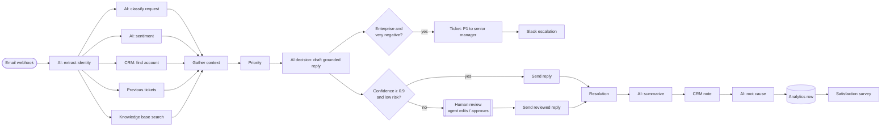

Five lookups run in parallel. The AI reply is grounded in the knowledge-base article and the account context,
and is only sent automatically when the model is confident and rates the risk low. Everything else goes to an
agent who can edit the draft. Enterprise customers who are very upset are escalated in parallel.

The other templates: AI sales lead qualification, employee onboarding, invoice processing (AI document
extraction), purchase approval (tiered n-of-m approvals), contract review, customer churn alert, recruitment
screening, incident escalation (SMS paging with acknowledgement timeout), and automated executive reporting.

## Benchmarks

<!-- BENCHMARK-TABLE -->

## Technologies

| Area | Stack |
|---|---|
| API | Python 3.11, FastAPI, Pydantic v2, SQLAlchemy 2 (async) + asyncpg, Alembic |
| Engine | Custom PostgreSQL job queue (`SKIP LOCKED`, leases, `LISTEN/NOTIFY`), AST-sandboxed expressions |
| AI | Official `anthropic` SDK; OpenAI, Gemini and OpenAI-compatible adapters over httpx; `jsonschema` |
| Data | PostgreSQL 16, Redis 7 |
| Console | Next.js 15 (App Router), React 19, TypeScript, Tailwind CSS 4, React Flow 12, Recharts |
| Security | Argon2id, PyJWT, AES-256-GCM (`cryptography`), HMAC-SHA256 webhooks |
| Observability | Prometheus, Grafana, OpenTelemetry, structured JSON logs |
| Delivery | Docker (multi-stage, non-root), Docker Compose, Kubernetes + Kustomize, GitHub Actions |
| Testing | pytest (169 cases, real PostgreSQL/Redis), respx, Playwright, custom async load harness |

## Getting started

**Docker Compose** (everything, including Prometheus and Grafana):

```bash
git clone https://github.com/faizanaziz21/AI-Workflow-Automation.git flowforge && cd flowforge
cp .env.example .env
docker compose up -d --build
docker compose --profile demo up seed          # demo org, sandbox connections, templates, sample runs
open http://localhost:8080                     # admin@acme.example / FlowForge-Demo-2026!
```

Grafana runs on `:3001` and Prometheus on `:9090`. The API docs are at `http://localhost:8080/docs`.

The demo works fully offline: its connections point at the bundled **sandbox**, which speaks the HubSpot, Jira,
Slack, SendGrid and OpenAI-compatible protocols, including a schema-aware fake LLM. To go live, point the
connections at real accounts. No workflow changes are needed.

**Local development and tests:** see [DEPLOYMENT.md](docs/DEPLOYMENT.md#local-development-no-containers) and
[TESTING.md](docs/TESTING.md).

```bash
cd backend && pip install -e ".[dev]" && pytest -q            # 169 tests, ~40 s
cd frontend && npm ci && npm run build && npx playwright test   # console E2E
python loadtest/flowforge_load.py --label my-run              # load test against a running stack
```

## Repository layout

```
backend/        FastAPI app, engine, workers, connectors, AI layer, templates, migrations, tests
frontend/       Next.js console (editor, inspector, approvals, dashboards), Playwright E2E
mock-services/  Sandbox: protocol-compatible HubSpot/Jira/Slack/SendGrid/helpdesk/ERP/LLM with chaos controls
loadtest/       Load and resilience harness, benchmark overlay, recorded results
deploy/         nginx, Prometheus + alerts, Grafana, OpenTelemetry, Kubernetes (Kustomize)
docs/           Architecture, engine, connectors, AI, security, deployment, API, scaling, testing, benchmarks
```

## Documentation

| Document | Contents |
|---|---|
| [ARCHITECTURE.md](docs/ARCHITECTURE.md) | System, execution and queue architecture, data model, request path, observability |
| [WORKFLOW_ENGINE.md](docs/WORKFLOW_ENGINE.md) | Definitions, expressions, lifecycle, retries, waits, approvals, loops, recovery guarantees |
| [CONNECTOR_SDK.md](docs/CONNECTOR_SDK.md) | Writing connectors, capabilities, triggers, OAuth, egress policy, plugins |
| [AI_LAYER.md](docs/AI_LAYER.md) | Providers, fallbacks, structured output, AI nodes, prompt versioning, cost tracking |
| [SECURITY.md](docs/SECURITY.md) | Threat model, authentication, RBAC, isolation, secrets, injection defences, audit |
| [API.md](docs/API.md) | REST conventions, endpoints, webhook signing |
| [DEPLOYMENT.md](docs/DEPLOYMENT.md) | Local, Docker Compose, Kubernetes, configuration, upgrades, backups, CI/CD |
| [SCALING.md](docs/SCALING.md) | How each tier scales, measured limits, growth path |
| [TESTING.md](docs/TESTING.md) | Test suites, E2E, load testing |
| [BENCHMARKS.md](docs/BENCHMARKS.md) | Recorded load-test results and the issues they uncovered |
| [PLAN.md](docs/PLAN.md) | Original design plan, ADRs, risks |
