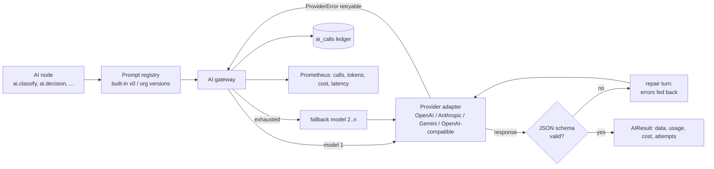

# AI layer

Every model call in FlowForge goes through one **AI gateway** (`backend/app/ai/gateway.py`). Workflows never talk
to a provider SDK directly. That gives each AI node the same guarantees, whichever provider serves it:

* provider-neutral model selection, with ordered **fallback models** across providers;
* **structured output** that is validated against a JSON schema, with automatic repair turns when the model
  returns something invalid;
* bounded **retries with jittered backoff** on transient provider errors, every attempt visible and costed;
* **token and cost accounting** per call, persisted in `ai_calls` and exported as Prometheus metrics;
* **versioned prompts** that can be changed per organization without editing workflows.



## Providers

Providers are connectors in the `ai` category, so their API keys are stored and rotated like any other
credential, and a workspace can hold several (for example a production OpenAI key and a local Ollama).

| Connector | Adapter | Structured output | Notes |
|---|---|---|---|
| `openai` | `providers/openai.py` | `response_format: json_schema` with `strict: true` when the schema is strict-compatible; otherwise `json_object` plus a schema instruction | Embeddings supported |
| `anthropic` | `providers/anthropic.py` (official `anthropic` SDK) | `output_config.format = {type: json_schema, schema}` | `output_config.effort` for reasoning depth; sampling parameters are not sent (current Claude models reject them). Server-side refusal fallback (`fallbacks="default"`) is enabled for models that support it. A refusal that survives it becomes a non-retryable `ProviderError(refusal=True)`, and the gateway moves on to the next configured model |
| `gemini` | `providers/gemini.py` | `responseMimeType: application/json` + `responseJsonSchema` | Embeddings supported |
| `openai_compatible` | same adapter as OpenAI with a configurable base URL | `json_schema`, `json_object` or prompt-only, per connection | Ollama, vLLM, LM Studio, Azure OpenAI-compatible gateways, the sandbox LLM |

Adding a provider means implementing the `LLMProvider` protocol (`chat`, `embed`, `list_models`) and registering a
connector for it. Nothing in the nodes or the engine changes.

The SDK clients are created with `max_retries=0`: retries belong to the gateway, so every attempt is visible in
the execution inspector and counted in the ledger.

## Model selection and fallbacks

Each AI node has a `model` block:

```json
{
  "connection_id": "c0ffee…",
  "model": "claude-opus-5-5",
  "fallbacks": [
    {"connection_id": "0pena1…", "model": "gpt-4.1"},
    {"connection_id": "local1…", "model": "llama3.1:70b"}
  ],
  "temperature": 0.2,
  "max_tokens": 2048,
  "effort": "medium",
  "prompt_version": null,
  "max_repair_attempts": 2
}
```

* An omitted `connection_id` resolves to the workspace's first AI connection; an omitted `model` to the
  connection's `default_model`. Workflows can be built before an AI provider is chosen.
* Per model, the gateway retries **retryable** provider errors (timeouts, 408/409/425/429, 5xx) up to
  `max_retries_per_model` times with jittered exponential backoff, then moves to the next fallback.
  Non-retryable errors (authentication, invalid request, refusal) move to the next fallback immediately.
* `temperature` is forwarded only to models that accept sampling controls; `effort` only to providers that
  support it.
* The node's own retry policy and `timeout_seconds` wrap the whole gateway call, so a hung provider still hits
  the node timeout and is retried at the workflow level.

## Structured output

AI nodes declare a JSON schema for their result. For every response the gateway:

1. asks the provider for schema-constrained output where it supports it;
2. strips code fences and parses JSON;
3. validates it with `jsonschema` (Draft 2020-12);
4. on failure, appends the invalid answer and the precise validation errors to the conversation and asks for a
   corrected value, up to `max_repair_attempts`;
5. if the model still fails, tries the next fallback model.

Node outputs are therefore always schema-valid, or the node fails with a clear error. A downstream `logic.switch`
on `{{ nodes.router.output.category }}` never sees a category outside the enum.

## AI nodes

| Node | Purpose | Output highlights |
|---|---|---|
| `ai.prompt` | Free-form prompt, text or JSON (custom schema) | `text`, `data` |
| `ai.classify` | Classify into your categories, single or multi-label; optional routing per category and an `uncertain` handle below a confidence threshold | `category`, `categories`, `confidence` |
| `ai.extract` | Extract fields (or a full schema) from text | `data` |
| `ai.summarize` | Paragraph, bullets, executive or ticket-resolution summaries | `summary`, `key_points` |
| `ai.sentiment` | Sentiment on a five-point scale with score and emotions | `sentiment`, `score`, `confidence`, `emotions` |
| `ai.document_analysis` | Analyse an uploaded file (PDF, text, xlsx) or text against instructions | `analysis`, `data` |
| `ai.embedding` | Vector embeddings | `vectors`, `dimensions` |
| `ai.decision` | Goal + policy + options → decision with confidence; optional routing per option and a `needs_review` handle under `min_confidence` | `decision`, `confidence`, `reasoning_summary` |
| `ai.lead_classifier` | Lead segment (`enterprise` … `not_a_fit`), priority, confidence, estimated deal value | `classification`, `priority`, `confidence`, `estimated_deal_value` |
| `ai.email_router` | Route inbound email to sales/support/billing/complaint/partnership/spam/other, with one output handle per route | `category`, `confidence`, `urgency`, `language` |
| `ai.document_extractor` | Invoices, contracts and purchase orders into typed fields, with risk flags | `document_type`, `fields`, `risks`, `confidence` |

Every AI node output includes `usage` (`provider`, `model`, `input_tokens`, `output_tokens`, `cost_usd`,
`latency_ms`, `attempts`, `fallback_used`), so cost can be routed on or reported per workflow.

**Human oversight.** Confidence thresholds route uncertain results to a `human.manual_review` or
`human.approval` node instead of acting automatically. In the flagship support template, the AI-drafted reply is sent
automatically only when the model decided to reply, its confidence is at least the configured
`auto_send_confidence` (0.9), and it rated the risk `low`. Every other draft goes to a human review step.

## Prompt versioning

The reusable components (lead classifier, email router, document extractor, sentiment, summarize, classify,
extract, decision, document analysis) are defined in a prompt registry (`ai/prompts.py`). Each has a system
prompt, a user template and an output schema. This built-in definition is **version 0**.

Organizations override prompts without touching workflows:

| API | Effect |
|---|---|
| `GET /ai/prompts` | Built-in and organization prompts with their active version |
| `GET /ai/prompts/{key}/versions` | Version history |
| `POST /ai/prompts/{key}/versions` | Publish a new version (system prompt, user template, optional schema and model settings); versions are immutable and numbered per org |
| `POST /ai/prompts/{key}/versions/{v}/activate` / `deactivate` | Choose which version unpinned nodes use |

A node uses the newest **active** organization version, or the built-in one if none is active. Setting
`prompt_version` pins a node to an exact version (`0` = built-in), which makes A/B tests and rollbacks explicit.
If a custom version omits a schema, the built-in schema still applies, so library nodes keep their output
contract. Prompt changes are audited, and every `ai_calls` row records `prompt_key` and `prompt_version`.

User data is placed inside delimited `<input>` blocks in the templates. System prompts tell the model to treat
that content as data, not instructions. Combined with schema-constrained output and confidence-based human review,
this limits the damage of prompt injection to a wrong *classification*, never an arbitrary action.

## Cost and token tracking

* `ai_calls` stores one row per attempt: provider, model, operation, prompt key/version, input/output tokens,
  cost (USD, `numeric`), latency, status (`success`, `error`, `invalid_output`), attempt number, whether a
  fallback served it, and the masked error. Rows link to the execution and node.
* Prices come from `ai/pricing.py` (USD per million tokens for current OpenAI, Anthropic and Gemini models).
  Organizations override or add prices in `organization.settings.ai_pricing`, for example for negotiated
  rates or fine-tuned models. Self-hosted models (`openai_compatible`) cost 0 unless priced explicitly.
* `GET /ai/usage?days=30&group_by=model|provider|workflow|day|prompt` aggregates calls, tokens, cost,
  failure rate and latency. The console's AI page charts it.
* Prometheus: `flowforge_ai_calls_total{provider,model,status}`, `flowforge_ai_tokens_total{…,direction}`,
  `flowforge_ai_cost_usd_total`, `flowforge_ai_latency_seconds`.

## Running without a provider

The sandbox (`mock-services`) exposes an OpenAI-compatible `/v1/chat/completions` that honours the requested JSON
schema. It analyses only the `<input>` blocks with keyword heuristics, so demo and test workflows produce
realistic, deterministic, schema-valid output without an API key. Point an `openai_compatible` connection
at it. Switching to a real model is a connection change.
