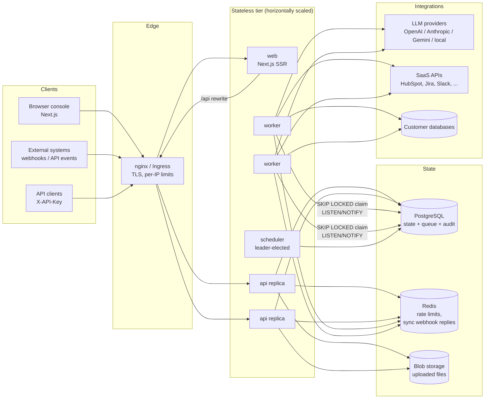
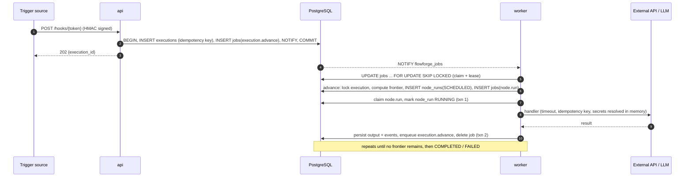
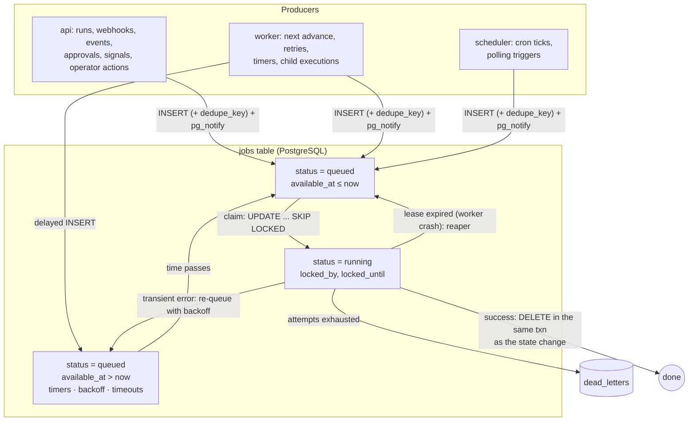
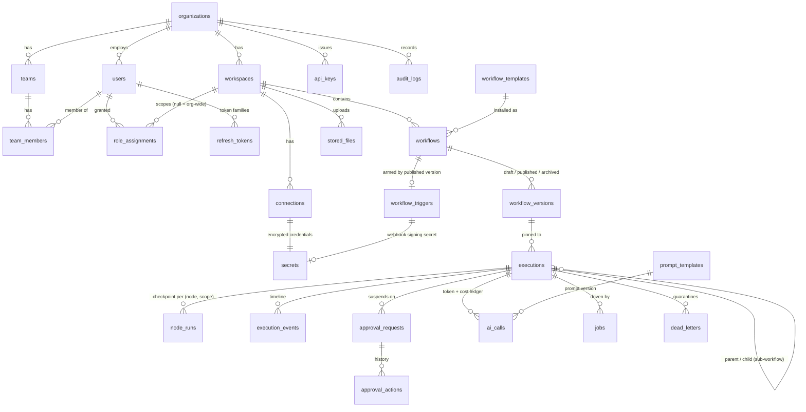

# Architecture

FlowForge AI is split into stateless processes that share one PostgreSQL database and one Redis instance.
PostgreSQL is the single source of truth: workflow definitions, execution state, the job queue, approvals, the
audit trail and encrypted credentials all live there. Redis only holds data that can be lost without harm:
rate-limit buckets and synchronous webhook replies.

The design rationale (ADRs, rejected alternatives, risk register) is in [PLAN.md](PLAN.md). This page describes
the system as built.

## System architecture



| Process | Entry point | Responsibilities | Scaling |
|---|---|---|---|
| `api` | `uvicorn app.main:app` | REST API, auth, RBAC, webhook ingestion, enqueueing executions | Horizontal (stateless); HPA on CPU |
| `worker` | `python -m app.workers.worker` | Claims jobs, runs node handlers, advances executions | Horizontal; HPA on CPU and queue depth |
| `scheduler` | `python -m app.workers.scheduler` | Reaps expired leases, fires cron and polling triggers, publishes queue gauges | One active leader (Postgres advisory lock); standbys are safe |
| `web` | Next.js standalone server | Operator console (editor, inspector, approvals, dashboards) | Horizontal |
| `sandbox` | `mock-services` | Protocol-compatible stand-ins for HubSpot, Jira, Slack, SendGrid, a helpdesk, an ERP and an LLM | Demo / load-test only |

Every process is configured purely through `FF_*` environment variables (`backend/app/core/config.py`) and
refuses to start in production with the development JWT secret or encryption key.

## Backend module map

```
backend/app/
├── api/            FastAPI routers, dependencies (principal, workspace, session), middleware
├── core/           config, security (JWT, hashing, HMAC), RBAC matrix, envelope crypto, masking,
│                   egress (SSRF) policy, rate limiter, metrics, tracing, structured logging
├── db/             SQLAlchemy models, enums, session factory
├── services/       business logic: auth, tenancy, workflows, executions, approvals, triggers,
│                   connections, templates, dashboard, audit
├── engine/         definition model, expression sandbox, graph analysis, validator, durable queue,
│                   executor (state machine), runner (node execution)
├── nodes/          76 node types: triggers, logic, data, AI, human, integrations (generated from connectors)
├── connectors/     connector SDK, registry, capability mapping, 13 built-in connector packages
├── ai/             AI gateway, provider adapters, pricing table, versioned prompt library
├── templates/      template DSL and the 10 marketplace templates
└── workers/        worker and scheduler processes
```

Layering rule: routers only translate HTTP to service calls and enforce permissions; services own transactions'
contents; the engine never imports from `api/`; node handlers reach the outside world only through
`NodeContext.runtime` (connections, AI gateway, file store, approvals), which keeps them testable and stops
them from reading credentials directly.

## Request path

1. **nginx** terminates the client connection, applies per-IP rate limits (`limit_req`, HTTP 429) and forwards
   `X-Forwarded-For` / `X-Request-ID`.
2. **`RequestContextMiddleware`** assigns a request id, binds it to the structured logger and, when tracing is enabled, opens a server span.
3. **`RateLimitMiddleware`** applies a GCRA limit in Redis per identity (user id / API key; per IP for auth
   endpoints; per token for webhooks).
4. **`BodySizeLimitMiddleware`** and **`SecurityHeadersMiddleware`** enforce payload caps and add CSP, HSTS,
   `X-Frame-Options`, `Referrer-Policy` and `Permissions-Policy`.
5. **Dependencies** resolve the `Principal` (JWT or API key), the tenant-scoped workspace (404 for foreign ids)
   and a database session. The session commits *before* the response is sent (`Depends(..., scope="function")`),
   so a client that is routed to a different replica on its next request always reads its own writes.
6. The router calls `principal.require(Permission.X, workspace_id)` and then the service layer.
7. Mutations write an `audit_logs` row in the same transaction.

## Execution architecture



The engine in depth (state machine, retries, waits, approvals, loops, recovery) is documented in
[WORKFLOW_ENGINE.md](WORKFLOW_ENGINE.md).

## Queue architecture



* **Claiming** is one `UPDATE … WHERE id IN (SELECT … FOR UPDATE SKIP LOCKED)` statement, so any number of
  workers can claim concurrently without contending on the same rows.
* **Wake-ups** use `LISTEN/NOTIFY`, with a 1-second poll as the fallback. Notifications are sent *after* the
  enqueuing transaction commits, coalesced per process over ~2 ms, from a separate autocommit connection. A
  NOTIFY inside the transaction would make PostgreSQL take a global lock at commit and serialise every
  enqueuing transaction; the load test measured 126 sessions queued on that lock before this change.
* **Leases and heartbeats:** each claimed job has `locked_until`. Workers extend the lease every few seconds for
  everything in flight. If a worker dies, the scheduler's reaper returns the job to `queued` and it runs again
  with the same idempotency key.
* **Deduplication:** a partial unique index on `dedupe_key WHERE status = 'queued'` guarantees at most one
  queued `execution.advance` per execution and exactly one job per cron tick, no matter how many producers race.
  A coalescing enqueue is an *upsert*: it row-locks the queued job until the producer commits, and claims skip
  locked rows, so a worker can never run the job against state the producer has not committed yet.
* **Self-healing:** every ~30 s the scheduler re-advances active executions that have no pending job and no
  recent node activity. Advancing is idempotent, so the sweep is safe even when it is not needed.
* **Completed jobs are deleted.** History lives in `node_runs` and `execution_events`, so the queue table stays
  small and its indexes stay hot.
* **Dead letters** keep the payload and error of a job whose attempts are exhausted. Operators can requeue or
  resolve them from the API.

## Data model



Integrity rules enforced by the schema:

| Constraint | Guarantees |
|---|---|
| `org_id` on every tenant-owned table, always filtered from the principal | Tenant isolation is structural; foreign ids return 404 |
| `executions (workflow_id, idempotency_key)` unique | A redelivered webhook or a repeated API call creates one execution |
| `node_runs (execution_id, node_id, scope)` unique | A node runs at most once per loop scope; retries are attempts on the same row |
| `jobs (dedupe_key) WHERE status = 'queued'` unique | One pending advance per execution; exactly-once cron ticks |
| `workflow_versions (workflow_id, version)` unique + content hash | Published snapshots are immutable; executions keep running on the version they started on |
| `audit_logs` GIN index on a `tsvector` expression | Full-text audit search without a separate search engine |

Migrations live in `backend/migrations` (Alembic). CI runs `alembic upgrade head` followed by an autogenerate
diff and fails if the models and migrations disagree.

## Frontend

The console is a Next.js 15 App Router application (React 19, Tailwind 4, React Flow 12, Recharts 3).

* All API traffic goes to the same origin (`/api/*` is rewritten to the backend), so refresh tokens can live
  in an `HttpOnly; SameSite=Strict` cookie and the access token is held only in memory.
* Node configuration forms are generated from each node type's JSON schema (`SchemaForm.tsx`), including
  connection pickers filtered by `x-connection` hints. A new node type or connector needs no frontend change.
* The editor validates continuously against `POST /workflows/{id}/validate` and draws per-node issue badges.
* The inspector reads node runs and events, masks secrets (server side), and exposes retry, resume, cancel and
  per-node replay according to the caller's permissions.

## Observability

| Signal | Source | Where |
|---|---|---|
| Metrics | `prometheus_client` in api, worker and scheduler (`/metrics`): HTTP latency, node runs and durations, retries, queue depth, oldest ready job, AI calls, tokens and cost | Prometheus + the provisioned Grafana dashboard; alert rules in `deploy/prometheus/alerts.yml` |
| Traces | OpenTelemetry: a server span per HTTP request, a span per claimed job and per node run (with execution, node and attempt attributes) | OTLP to any collector; compose `tracing` profile ships Jaeger |
| Logs | JSON structured logs carrying `request_id`, `org_id`, `execution_id`; secret values redacted by a logging filter | stdout, for the platform's log pipeline |
| Product analytics | `GET /dashboard/*`: success rate, P95 duration, failure hotspots, AI spend, approval latency | Console dashboard |
| Audit | `audit_logs` | Console audit page, `GET /audit-logs` |

## Related documents

* [WORKFLOW_ENGINE.md](WORKFLOW_ENGINE.md): execution semantics, retries, waits, recovery
* [CONNECTOR_SDK.md](CONNECTOR_SDK.md): building integrations
* [AI_LAYER.md](AI_LAYER.md): providers, structured output, prompts, cost tracking
* [SECURITY.md](SECURITY.md): threat model and controls
* [API.md](API.md): REST reference
* [DEPLOYMENT.md](DEPLOYMENT.md), [SCALING.md](SCALING.md), [TESTING.md](TESTING.md), [BENCHMARKS.md](BENCHMARKS.md)
