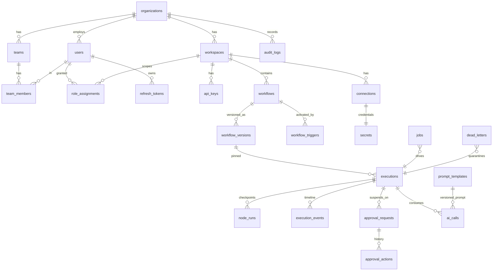
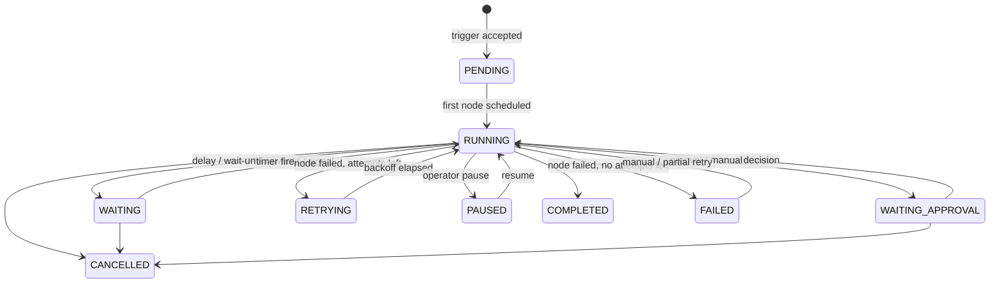

# FlowForge AI — Design Plan

This document is the output of the design phase (steps 1–9 of the development process).
It was written before any code and is kept up to date as the "why" behind the implementation.
Detailed reference documentation lives in the other files under `docs/`.

---

## 1. Requirements analysis

### Functional pillars

| Pillar | Key requirements | Hardest part |
|---|---|---|
| Multi-tenancy | Org → Workspace → Team → User, six roles, every sensitive action permission-checked | Making isolation *structural* (impossible to forget) rather than per-endpoint |
| Visual builder | Drag-and-drop DAG editor, ~50 node types, per-node config UI, validation | Generic config UI driven by node schemas so nodes are added without frontend work |
| Durable engine | Persistence, retries + backoff, timeouts, idempotency, checkpointing, resume after crash, cancel, pause, manual/partial retry, DLQ | Correctness under concurrent workers and crashes at any instruction |
| Human-in-the-loop | Suspend, approve/reject, comments, escalation, deadlines, history; resume at the exact node | Long suspensions (days) without holding any process/thread |
| AI layer | Provider abstraction (OpenAI/Anthropic/Gemini/local), schema-validated output, retries on malformed output, fallback model, token + cost tracking, prompt versioning | Guaranteeing *validated* structured output from any provider |
| Integrations | Connector SDK (auth, triggers, actions, schemas, test, refresh); several real connectors | Keeping connectors decoupled from engine & credentials |
| Secrets | Encrypted at rest, never in definitions, masked in logs/outputs, rotation | Masking secrets that leak into *data* (e.g. an API echoing a token) |
| Observability | Dashboard KPIs, execution timeline, inspector with replay/retry/resume | Cheap aggregate queries at high execution volume |
| Versioning | Draft/Published/Archived, executions pinned to version, clone/rollback/diff | Immutable published snapshots with a mutable draft |
| Security | RBAC, isolation, rate limits, audit, CSRF, headers, webhook signing, injection/XSS protection | Defence in depth |

### Non-functional targets

* **Throughput:** thousands of executions/hour on a single small node; horizontal scale by adding workers.
* **Durability:** no acknowledged execution is ever lost; every state transition is a committed DB write.
* **Latency:** webhook ingestion P95 < 100 ms (ingest is a single insert + enqueue).
* **Deployability:** `docker compose up` for dev; Kubernetes manifests for prod; stateless API/worker pods.

---

## 2. Architecture decisions

### ADR-1: Custom Postgres-backed durable execution engine (instead of Celery/Temporal)

* **Celery** gives at-least-once task delivery but no workflow state model; durable timers (wait 3 days),
  human approvals and partial retries would all have to be built on top anyway, and Redis-as-broker loses
  messages on failover unless carefully configured.
* **Temporal** is excellent but adds a separate cluster (frontend/history/matching/worker services + its own DB),
  and its determinism constraints leak into the node SDK.
* **Chosen:** PostgreSQL is the single source of truth. A transactional job queue (`jobs` table claimed with
  `SELECT … FOR UPDATE SKIP LOCKED`, lease + heartbeat, LISTEN/NOTIFY for low latency) drives a step-function
  engine. Because the queue lives in the same database as execution state, *state change + next job enqueue
  happen in one ACID transaction* — the classic dual-write problem disappears. This is the same pattern used
  by Oban, Graphile Worker, and Solid Queue, and it comfortably sustains thousands of jobs/second.
* Redis is used for what it is good at: rate limiting, synchronous webhook-response hand-off, and caching —
  never as the system of record.

### ADR-2: Graph (DAG) execution with dead-path elimination

Workflows are directed graphs. A node becomes runnable when all incoming edges are *resolved*;
it runs if at least one incoming edge is *active*, otherwise it is *skipped* and the skip propagates.
This gives IF/Switch/Parallel/Merge semantics without special cases. Loops are scoped sub-graphs
(see §6). Cycles outside loops are rejected by the validator.

### ADR-3: Expressions via a whitelisted AST evaluator

Node configuration can reference data (`{{ nodes.classify.output.priority }}`). Expressions are parsed with
Python's `ast` module and evaluated by an interpreter that only allows literals, comparisons, boolean/arithmetic
operators, subscripts/attribute access on plain data and a fixed set of pure functions. No `eval`, no attribute
access on Python objects, bounded execution — workflow authors cannot escape the sandbox.

### ADR-4: Connectors are plugins; nodes are generated from connector actions

A connector declares metadata, auth scheme, actions and triggers with Pydantic input/output models.
The node registry generates a node type per action (`hubspot.upsert_contact`), so a new connector appears in the
editor palette — with a config form generated from its JSON schema — without any engine or frontend change.

### ADR-5: AI gateway

All model calls go through one gateway that handles provider selection, structured output enforcement
(JSON-schema validation + repair retries), fallback models, token/cost accounting, and persistence of every call.
Providers are thin HTTP adapters (OpenAI, Anthropic, Gemini, OpenAI-compatible for Ollama/vLLM/LM Studio).

### ADR-6: Envelope encryption for secrets

Each credential is encrypted with a random data key (AES-256-GCM); the data key is wrapped by a versioned key
encryption key (KEK) from configuration/KMS. Rotation re-wraps data keys without touching ciphertext.
Workflow definitions only ever contain `connection_id`s.

### ADR-7: Tenant isolation is enforced in the data-access layer

Every tenant-owned table has `org_id`. Repositories require a `TenantContext` and add the `org_id` predicate
themselves; API dependencies build the context from the authenticated principal. Cross-tenant IDs therefore
return 404, not 403 (no existence oracle). Tests attack every resource type across tenants.

---

## 3. Database schema (summary)



Key constraints:

* `node_runs (execution_id, node_id, scope)` unique — a node executes at most once per scope; retries are attempts on the same row.
* `executions (workflow_id, idempotency_key)` unique — duplicate webhook deliveries create one execution.
* `jobs (dedupe_key)` partial-unique while queued/running — exactly one pending "advance" per execution, one cron fire per tick.
* `workflow_versions (workflow_id, version)` unique; published definitions are immutable (enforced in service layer, hash stored).

---

## 4. Repository structure

```
backend/            FastAPI app, engine, workers, connectors, AI layer, Alembic migrations, tests
frontend/           Next.js 15 + React Flow + Tailwind console
mock-services/      Sandbox implementations of CRM/ticketing/KB/chat/LLM APIs for demos & load tests
deploy/             Dockerfiles, nginx, Prometheus, Grafana, Kubernetes (kustomize) manifests
loadtest/           Load generator + scenarios + recorded results
docs/               Architecture & operations documentation
.github/workflows/  CI
```

---

## 5. API surface (v1)

All endpoints under `/api/v1`, JSON, bearer JWT or `X-API-Key`. Tenant comes from the principal, workspace from the path.

| Area | Endpoints |
|---|---|
| Auth | `POST /auth/register-org`, `/auth/login`, `/auth/refresh`, `/auth/logout`, `GET /auth/me` |
| Tenancy | `/orgs/current`, `/workspaces`, `/teams`, `/users`, `/users/{id}/roles`, `/api-keys` |
| Catalog | `GET /node-types`, `GET /connectors` |
| Workflows | `/workspaces/{ws}/workflows` CRUD, `PUT …/draft`, `POST …/validate`, `POST …/publish`, `GET …/versions`, `GET …/versions/diff`, `POST …/rollback`, `POST …/clone`, `POST …/archive` |
| Executions | `POST …/workflows/{id}/run`, `GET /executions`, `GET /executions/{id}` (+ node runs, events), `POST /executions/{id}/cancel|pause|resume|retry`, `POST /executions/{id}/nodes/{node}/replay`, `POST /executions/{id}/signals/{name}` |
| Triggers | `POST /hooks/{token}` (public, signed), `POST /events` (API events), file upload |
| Approvals | `GET /approvals` (inbox), `GET /approvals/{id}`, `POST /approvals/{id}/approve|reject|comment|reassign` |
| Connections | `/workspaces/{ws}/connections` CRUD, `POST …/test`, `POST …/rotate` |
| AI | `/ai/prompts` (versioned), `GET /ai/usage` |
| Templates | `GET /templates`, `POST /templates/{slug}/install` |
| Ops | `GET /dashboard/summary|timeseries`, `GET /dead-letters`, `POST /dead-letters/{id}/requeue`, `GET /audit-logs`, `/healthz`, `/readyz`, `/metrics` |

---

## 6. Workflow execution model



Two job kinds drive everything:

1. **`execution.advance`** — locks the execution row, computes the frontier (runnable nodes) from committed
   `node_runs`, creates `node_runs` in `SCHEDULED` state and enqueues `node.run` jobs, propagates skips,
   detects completion/failure. Deduplicated: at most one pending advance per execution.
2. **`node.run`** — claims the node run, resolves expressions against the checkpointed context, runs the handler
   with a timeout and an idempotency key, then in **one transaction** persists output/error and enqueues the next
   advance. A handler may return *wait* (timer job at `available_at`), *wait for approval* (approval request row),
   or *wait for signal*.

Crash safety: a worker crash leaves its job leased; the reaper returns it to the queue after the lease expires and
the node re-runs with the same idempotency key (at-least-once execution, exactly-once *effects* where the target
supports idempotency keys). Nothing lives only in memory.

Loops: a Loop node's `body` handle starts a sub-graph executed once per item in its own *scope*
(`loop_id:index`), with bounded concurrency. Node runs are keyed by `(node_id, scope)`, so iterations checkpoint
and retry independently.

---

## 7. Milestones

| # | Milestone | Exit criteria |
|---|---|---|
| M1 | Backend foundation: config, models, migrations, auth (JWT + rotating refresh), tenancy, RBAC, audit, security middleware | Auth/RBAC/isolation tests green |
| M2 | Secrets + connector SDK + connectors (HTTP/REST, Slack, Teams, SMTP/IMAP, Postgres, MySQL, HubSpot, Jira, Google Drive, Twilio) | Connector tests with mocked HTTP green |
| M3 | Definitions, node registry, expressions, validator, versioning | Validator/expression/versioning tests green |
| M4 | Durable engine: queue, worker, scheduler, retries, timeouts, approvals, signals, cancel/pause/retry/replay, DLQ | Engine + crash-recovery tests green |
| M5 | AI gateway + AI nodes | Structured output, fallback, cost tests green |
| M6 | Triggers (signed webhooks, cron, events, polling), templates, flagship demo, mock services | Flagship workflow runs end-to-end |
| M7 | Observability: metrics, dashboard API, tracing | Dashboard endpoints tested |
| M8 | Frontend console | Builds; Playwright e2e passes |
| M9 | DevOps: Docker, compose, k8s, CI | `docker compose up` healthy |
| M10 | Load testing, benchmarks, screenshots, docs | Results recorded in docs |

---

## 8. Security risks & mitigations

| Risk | Mitigation |
|---|---|
| Cross-tenant data access (IDOR) | Tenant-scoped repositories; 404 on foreign IDs; isolation test-suite |
| Privilege escalation | Central permission matrix; role grants cannot exceed granter's role; audit of all grants |
| Credential leakage via definitions/logs/outputs | Connections by reference; envelope encryption; log redaction filter; value-based masking of secrets in node outputs and events |
| Expression injection / RCE | AST whitelist interpreter; no `eval`, no dunder access, bounded size/time |
| SQL injection in DB nodes | Parameterised queries only (`:param` binding); read-only mode option; statement timeout |
| SSRF via HTTP node | Configurable egress policy blocking private/link-local/metadata ranges by default |
| Webhook spoofing / replay | HMAC-SHA256 over `timestamp.body`, 5-minute tolerance, idempotency key dedupe |
| Token theft | Short-lived access tokens; refresh-token rotation with reuse detection (family revocation) |
| Brute force / abuse | Redis rate limiting per IP/principal; login throttling |
| XSS | React escaping; strict CSP; no `dangerouslySetInnerHTML`; JSON-only API |
| CSRF | Bearer tokens (not cookies) for API; double-submit token if cookie auth is enabled |
| Prompt injection into AI decisions | Schema-constrained outputs, confidence thresholds, human approval gates for high-impact actions |

## 9. Scaling risks & mitigations

| Risk | Mitigation |
|---|---|
| Queue table bloat / hot rows | Completed jobs deleted on completion (history lives in node_runs/events); partial indexes on queued rows; autovacuum tuning |
| Many workers polling Postgres | LISTEN/NOTIFY wake-ups + jittered polling; batch claim |
| Large payloads in JSONB | Per-node output size cap; large blobs go to file storage with references |
| Hot execution row lock under wide fan-out | Advance is deduplicated (one pending per execution) so fan-in coalesces |
| Dashboard aggregates on huge tables | Time-bounded queries on indexed `(org_id, created_at)`; Prometheus for real-time series |
| LLM latency / rate limits | Per-provider concurrency limits, timeouts, fallback models, retries with backoff |
| Long waits (days) | Waits are rows + future-dated jobs, consuming no worker capacity |
| Single Postgres | Vertical scale + read replicas for dashboards; partition `execution_events` / `node_runs` by month (documented) |
