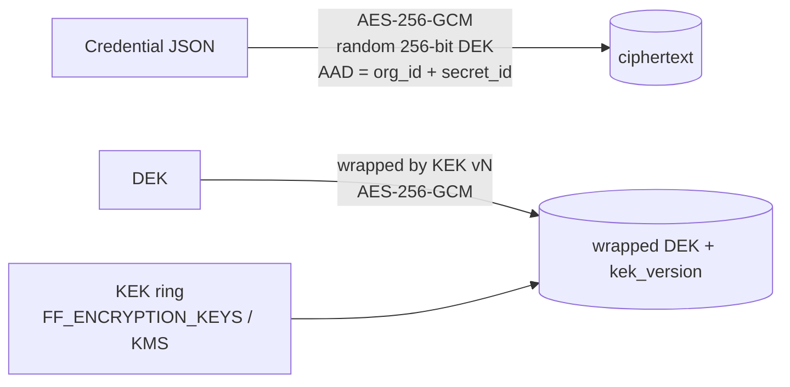

# Security

FlowForge runs customer-authored automation against customer credentials, so it is built with defence in depth.
Tenant isolation is structural rather than per-endpoint. Secrets are encrypted, referenced and masked. Every
input crossing a trust boundary (HTTP bodies, webhook payloads, expressions, SQL, URLs, model output) is
validated. Security-relevant activity is audited.

## Threat model (summary)

| Asset | Threats | Primary controls |
|---|---|---|
| Tenant data (workflows, executions, files) | IDOR / cross-tenant access, privilege escalation | Org-scoped queries from the principal, 404 on foreign ids, RBAC matrix, grant rules, isolation tests |
| Credentials for third-party systems | Exfiltration from DB, logs, definitions, outputs; misuse by other users | Envelope encryption, reference-only definitions, write-only API, value-based masking, connection access policies |
| User accounts | Credential stuffing, token theft, session fixation | Argon2id, lockout, rate limits, short-lived JWTs, rotating refresh tokens with reuse detection, HttpOnly cookies + CSRF |
| Platform hosts / internal network | SSRF via HTTP nodes and connector URLs, RCE via expressions | Egress policy, AST-whitelisted expression interpreter, no `eval`, bounded evaluation |
| Customer databases | SQL injection through workflow data | Bound parameters only, identifier validation, read-only mode, statement timeouts |
| Automation integrity | Webhook spoofing/replay, prompt injection driving actions | HMAC signatures with timestamp tolerance, idempotency keys, schema-constrained AI output, confidence gates and human approval |
| Accountability | Repudiation, silent changes | Append-only audit log of security-relevant actions with actor, IP, request id and outcome |

## Authentication

* **Passwords** are hashed with **Argon2id** (`time_cost=2, memory_cost=19 MiB`). Policy: at least 12 characters
  and three of four character classes.
* **Lockout**: 5 consecutive failures lock the account for 15 minutes. Attempts against a locked account are
  audited, and the failure counter is committed even though the request fails.
* **Access tokens**: HS256 JWTs (issuer, audience, 15-minute expiry), bound to a session family. Revoking the
  family (logout, reuse detection, deactivation) invalidates outstanding access tokens immediately.
* **Refresh tokens**: random 256-bit values stored as SHA-256 hashes and **rotated on every use**. Presenting
  an already-rotated token is treated as theft: the whole family is revoked and the event is audited.
* **Browser sessions**: the refresh token lives in an `HttpOnly; Secure (in production); SameSite=Strict` cookie
  scoped to `/api/v1/auth`. The access token is kept in memory only, never in `localStorage`. Cookie-based
  refresh and logout require a **double-submit CSRF token** (`ff_csrf` cookie echoed in `X-CSRF-Token`). Other
  API calls use the `Authorization` header, which browsers do not attach cross-site.
* **API keys** (`ffk_<prefix>_<secret>`): shown once, stored as SHA-256 hashes, scoped to a role and optionally a
  workspace, revocable, with last-used tracking. They can never grant more than their creator holds.
* The user and organization are re-loaded on every request, so a deactivated user or organization is locked
  out immediately, including with access tokens issued earlier.

## Authorization (RBAC)

Permissions are checked in the API layer with `principal.require(permission, workspace_id)`. Roles can be
granted for the whole organization or for a single workspace.

| Permission | Viewer | Approver | Operator | Workflow Developer | Org Admin | Super Admin |
|---|:-:|:-:|:-:|:-:|:-:|:-:|
| Read workflows, executions, connections (metadata), dashboards, approvals | ✓ | ✓ | ✓ | ✓ | ✓ | ✓ |
| Decide approvals | | ✓ | | | ✓ | ✓ |
| Run workflows, publish events, upload files | | | ✓ | ✓ | ✓ | ✓ |
| Cancel / pause / resume / retry / replay, manage dead letters | | | ✓ | ✓ | ✓ | ✓ |
| Use connections in workflows | | | ✓ | ✓ | ✓ | ✓ |
| Create / edit / publish workflows, manage connections and prompts | | | | ✓ | ✓ | ✓ |
| Delete workflows, read unmasked execution data | | | | | ✓ | ✓ |
| Manage users, teams, workspaces, API keys; read audit log | | | | | ✓ | ✓ |
| Platform administration (all orgs) | | | | | | ✓ |

Rules enforced on top of the matrix:

* A user can only grant roles at or below their own rank. Org Admin and Super Admin are org-scoped only. The last
  Org Admin cannot be removed.
* Approval decisions additionally require being a listed approver (directly, via team or role) or an Org Admin.
* Connections can carry an **access policy** (allowed roles and/or teams). Only allowed users can reference
  them in workflows, and the check runs on save and publish.

## Tenant isolation

* Every tenant-owned table carries `org_id`. Services always filter by the authenticated principal's
  `org_id`, and workspace-scoped principals additionally by their allowed workspaces.
* Resources from another tenant return **404, not 403**, so their existence cannot be probed.
* Executions, connections and approvals resolve related objects only inside the execution's own organization
  and workspace. A workflow cannot reference another workspace's connection, even by guessing its id.
* `tests/test_tenancy.py`, `test_auth.py`, `test_connections_api.py` and `test_workflows_api.py` attack
  cross-tenant and cross-workspace access for users, workflows, executions, connections, audit logs and API keys.

## Secrets management

* **Envelope encryption**: each secret has its own data key. The key is wrapped by a versioned key-encryption
  key. The associated data binds the ciphertext to its organization and secret id, so a ciphertext copied to
  another tenant's row fails authentication.
* **KEK rotation**: add a new key version, make it active, and run `python -m app.cli rewrap-secrets` (or
  `POST /admin/secrets/rewrap`). Data keys are re-wrapped without decrypting the payloads. Old KEKs can then be
  retired.
* **Credential rotation**: `POST /connections/{id}/rotate` writes a new secret version. Running workflows pick it
  up on their next node.
* **Write-only API**: connection responses list *which* credential fields are set, never their values. Masked
  placeholders sent back by a client are ignored, so a round-tripped form cannot overwrite a secret with `••••`.
* **Never in definitions**: workflows reference `connection_id`s only. Templates use `${connection:role}`
  placeholders that are bound at install time.
* **Masking**:
  * *by key*: values under keys like `password`, `token`, `secret`, `api_key`, `authorization` and `cookie` are
    masked in inputs, outputs, events and errors;
  * *by value*: every secret value resolved during a node run is registered and scrubbed wherever it appears,
    including inside free text, such as an API echoing a token back;
  * *by pattern*: bearer tokens, `sk-…`/`sk-ant-…` keys, Slack tokens and credentials embedded in connection
    URLs are redacted from log lines and exception traces by the logging formatter;
  * *per workflow*: `settings.mask_fields` masks business-sensitive fields (for example `iban`) in the
    inspector. Only Org Admins (`executions:read_sensitive`) see unmasked execution data.
* Production startup refuses the development JWT secret and encryption key.

## Input validation and injection defences

| Vector | Defence |
|---|---|
| Request bodies | Pydantic models with `extra="forbid"`, length limits, regex patterns; body-size limit middleware |
| Workflow definitions | Schema-validated definitions and per-node config models; validator runs on save and publish |
| Expressions (`{{ }}`) | Parsed with `ast` and interpreted by a whitelist: no `eval`/`exec`, no attribute access on Python objects, no dunders, no imports. Length, steps and output size are bounded |
| SQL nodes | Bound parameters only (`:name` → positional); identifiers validated; read-only mode runs in a read-only transaction and rejects write statements; per-connection `statement_timeout` |
| HTTP / connector URLs (SSRF) | Egress policy blocks loopback, private, link-local (cloud metadata), CGNAT, multicast and reserved addresses on every request including redirects; allowlist for intentional internal targets |
| File uploads | Size cap (`FF_MAX_UPLOAD_BYTES`), stored under generated keys (the user filename is only metadata, basename-sanitised), served as attachments |
| XSS | React escaping, no `dangerouslySetInnerHTML`, strict Content-Security-Policy on the console, `default-src 'none'` on API responses |
| AI output | JSON-schema validated before any downstream node sees it; enums constrain routing |
| Prompt injection | User content inside delimited `<input>` blocks with an explicit "data, not instructions" system rule; schema-constrained output; confidence thresholds route uncertain cases to humans; high-impact actions sit behind approval nodes |

## Webhooks

* Each webhook trigger has an unguessable token in its URL and, by default, an **HMAC-SHA256 signing secret**.
  The signature (`X-FlowForge-Signature: v1=<hex>`) covers `timestamp + "." + raw body`. Requests outside a
  5-minute window (`X-FlowForge-Timestamp`) are rejected to prevent replay.
* Alternatively a trigger can require an API key, or (explicitly) no authentication.
* Signature verification uses constant-time comparison. Signature headers are stripped from the stored payload.
* `Idempotency-Key` deduplicates retried deliveries, and secrets can be rotated per trigger.
* Webhooks have their own rate limit bucket per token.

## Transport and browser security

* Security headers on every API response: `Content-Security-Policy`, `X-Content-Type-Options: nosniff`,
  `X-Frame-Options: DENY`, `Referrer-Policy`, `Permissions-Policy`, `Cross-Origin-Opener-Policy`,
  `Cache-Control: no-store`, and `Strict-Transport-Security` in production. The console sets its own CSP
  (`default-src 'self'`, `connect-src 'self'`, `frame-ancestors 'none'`).
* CORS is allow-listed (`FF_CORS_ORIGINS`). The console is same-origin through the `/api` rewrite, so it needs no
  CORS at all.
* TLS terminates at the ingress (cert-manager in the Kubernetes overlay). Internal traffic is restricted by
  NetworkPolicies (only the ingress controller reaches `web`/`api`; only `api`/`worker`/`scheduler` reach
  PostgreSQL and Redis).

## Rate limiting and abuse

* **Edge** (nginx / ingress): per-IP request rates with bursts, HTTP 429.
* **Application** (Redis GCRA, shared across replicas): per user or API key for the API (default 600/min), per
  IP for auth endpoints (20/min), and per webhook token (3,000/min). Responses include `Retry-After`.
* Login lockout as above; webhook payload size limits.

## Audit logging

* Every security-relevant action writes an `audit_logs` row: logins (success, failure, lockout), token reuse,
  user and role changes, API key creation and revocation, connection create/update/rotate/test, OAuth
  authorization, secret re-wraps, webhook-secret reveals and rotations, workflow publish, rollback and delete,
  execution start/cancel/retry/replay, approval decisions, and prompt versions.
* Each row has actor (user or API key), action, resource, outcome (`success`/`failure`/`denied`), IP, user agent,
  request id and structured details. Secret values are never recorded.
* Rows are written in the same transaction as the change they describe, so there is no change without a record.
* Full-text search (`GET /audit-logs?q=…`) uses a GIN index. Filters cover action prefix, outcome, actor,
  resource and time range. The log is visible to Org Admins only and is tenant-scoped.

## Operational security

* Containers run as a non-root user (uid 10001) with read-only application code and no build tools in the
  runtime image. Kubernetes pods add `runAsNonRoot`, `readOnlyRootFilesystem`, dropped capabilities and
  `seccompProfile: RuntimeDefault`.
* Secrets reach pods through Kubernetes Secrets (or an external secrets operator). Nothing sensitive is baked
  into images or committed. `.env` is git-ignored and `.env.example` holds placeholders only.
* CI runs lint, type checks, migrations-vs-models drift detection, the full test suite, a frontend build and E2E
  tests on every push.

## Reporting a vulnerability

Please email the maintainer privately rather than opening a public issue, and include reproduction steps.
Reports are acknowledged within two business days.
