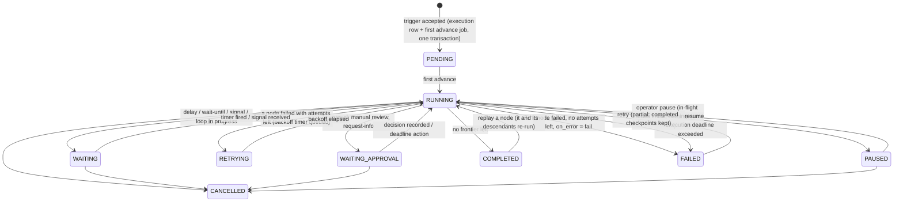

# Workflow engine

The engine turns a published workflow definition into a durable execution: a state machine stored in
PostgreSQL and moved forward by small, idempotent jobs. No execution state lives only in a worker's memory, so
any worker can crash at any instruction and another one picks the work up.

Code: `backend/app/engine/` (`definition.py`, `graph.py`, `validation.py`, `expressions.py`, `queue.py`,
`executor.py`, `runner.py`) and `backend/app/workers/`.

## Workflow definitions

A definition is JSON validated by `WorkflowDefinition` (`engine/definition.py`):

```json
{
  "nodes": [
    {"id": "hook", "type": "trigger.webhook", "config": {}},
    {"id": "enrich", "type": "data.http_request",
     "config": {"url": "https://api.example.com/companies", "query": {"domain": "{{ trigger.body.domain }}"}},
     "retry": {"max_attempts": 4, "initial_interval_seconds": 0.5, "backoff_coefficient": 2},
     "timeout_seconds": 5},
    {"id": "classify", "type": "ai.classify",
     "config": {"text": "{{ trigger.body.message }}",
                "categories": [{"name": "hot"}, {"name": "warm"}, {"name": "cold"}]},
     "on_error": "route"}
  ],
  "edges": [
    {"source": "hook", "target": "enrich"},
    {"source": "enrich", "target": "classify"}
  ],
  "settings": {"execution_timeout_seconds": 86400, "max_parallel_nodes": 16}
}
```

| Field | Meaning |
|---|---|
| `node.retry` | `max_attempts` (incl. the first), `initial_interval_seconds`, `backoff_coefficient`, `max_interval_seconds`, `jitter`, `retry_on` (`retryable` or `all`). Falls back to `settings.default_retry` |
| `node.timeout_seconds` | Hard per-attempt timeout; falls back to `settings.default_node_timeout_seconds`, the node type's default, then `FF_DEFAULT_NODE_TIMEOUT_SECONDS` |
| `node.on_error` | `fail` (default) fails the execution; `continue` emits `{"error": …}` on `out`; `route` follows the node's `error` handle |
| `node.disabled` | The node is skipped and the skip propagates |
| `edge.source_handle` | Which output handle the edge leaves from (`out`, `true`/`false`, a switch case, `branch_1`, `body`/`done`, `error`, `approved`/`rejected`, …) |
| `settings.max_parallel_nodes` | Cap on concurrently scheduled nodes of one execution |
| `settings.mask_fields` | Extra output keys masked in the inspector |

Credentials never appear in definitions. Nodes reference a `connection_id`. Template placeholders such as
`${connection:crm}` are bound to connection ids at install time.

### Validation

`POST /workflows/{id}/validate` (and every publish) runs `engine/validation.py`:

* structural: unique node ids and known node types, edges reference existing nodes and handles, exactly one
  trigger with no incoming edges, no cycles outside loop bodies (errors); nodes unreachable from the trigger
  (warning);
* per node: config validated against the node type's Pydantic model, where fields containing `{{ }}` are
  type-checked after rendering at run time. Also semantic checks such as cron syntax, and "Select a connection"
  for nodes that need one;
* expressions: parsed (not evaluated) and checked against the whitelist; references to unknown nodes are
  reported.

Publishing snapshots the definition into an immutable `workflow_versions` row with a content hash and arms the
trigger. Running executions keep the version they started on.

### Expressions

`{{ … }}` templates are evaluated by a whitelisting AST interpreter (`engine/expressions.py`), never by `eval`.

* Data in scope: `trigger`, `nodes.<id>.output`, `vars` (from `logic.set_variable`), `execution` (id,
  workflow id, trigger type, start time, retry count, correlation key), `incoming` (ids of the nodes that
  activated this one), and inside loop bodies `loop.item` / `loop.index` (`loops.<loop_id>` for outer loops).
* Allowed: literals, arithmetic, comparisons, boolean logic, conditional expressions, subscripts and attribute
  access *on plain data*, single-loop comprehensions, and about 50 pure functions (`len`, `lower`, `split`,
  `join`, `pluck`, `unique`, `default`, `coalesce`, `date_add`, `date_diff`, `format_date`, `regex_extract`,
  `parse_json`, …).
* Rejected: names outside the scope, dunder access, calls on arbitrary objects, lambdas, imports. Expression
  length (4,000 chars), evaluation steps (100,000) and produced sequence/string sizes are bounded.
* A field that is *exactly* one template keeps the value's type (`"{{ nodes.a.output.items }}"` renders a
  list); mixed text renders a string.

## Execution lifecycle



The execution status is derived on every advance from the node runs: any `RETRYING` node means `RETRYING`;
otherwise any approval wait means `WAITING_APPROVAL`; otherwise any wait means `WAITING`; otherwise `RUNNING`.

Node runs move through `SCHEDULED → RUNNING → COMPLETED | FAILED | RETRYING | WAITING | WAITING_APPROVAL`,
plus `SKIPPED` (dead path) and `CANCELLED`.

## Two job kinds drive everything

### `execution.advance`: the scheduler of one execution

1. Lock the execution row (`SELECT … FOR UPDATE`) so concurrent advances of the same execution serialise.
2. Load the definition from an in-process LRU cache (published versions are immutable) and the execution's
   committed `node_runs`.
3. If any node run is `FAILED`, fail the execution, cancel outstanding work and record the error.
4. Compute the **frontier**: nodes whose incoming edges are all resolved. A node is *runnable* if at least one
   incoming edge is active (its source completed and emitted that handle). If every incoming edge is inactive,
   the node is `SKIPPED` and the skip propagates (**dead-path elimination**). This gives IF, Switch, Parallel and
   Merge semantics without special cases: a Merge after an IF runs once with whichever branch was taken.
5. Insert `node_runs` in `SCHEDULED` (bounded by `max_parallel_nodes`) and enqueue one `node.run` job each.
6. If nothing is in flight or waiting and no frontier remains, complete the execution. Its output is the
   outputs of the sink nodes.

Advance jobs carry `dedupe_key = advance:<execution_id>`, and the partial unique index allows only one *queued*
copy. A fan-in of 20 parallel branches finishing at once therefore coalesces into a few advances instead of 20.
Coalescing is an upsert that row-locks the queued job until the producer commits. Without that, a worker could
claim the queued advance in the gap before the producer's commit, see the node still `RUNNING`, and the
wake-up would be lost. The load-test harness found exactly this race, and `test_dedupe_enqueue_blocks_claim_until_commit`
pins the fix.

### `node.run`: execute one node attempt

Two short transactions around the side effect:

1. **Claim** (txn 1): lock the node run; ignore stale or duplicate deliveries (already finished, wrong wait
   sequence, execution cancelled); set `RUNNING`, increment `attempt`, write a `node_started` event.
2. **Execute** (no transaction held): build the data context from committed outputs, render the config, validate
   it against the node's model, and run the handler under `asyncio.wait_for(timeout)` with the node's
   **idempotency key** (`ff-<execution>-<node>[-<scope>]`). HTTP-based writes send it as `Idempotency-Key`.
   Credentials are decrypted in memory only for the duration of the call.
3. **Persist** (txn 2): re-lock the node run and discard the result if the run was cancelled or replayed
   meanwhile. Otherwise store the masked output or error, write events, apply the retry policy, enqueue the next
   advance and delete the `node.run` job itself, all in one commit.

Because the state change and the follow-up job are written in the same transaction, there is no window in which
a node completed but nothing will advance the execution, or the reverse.

## Retries, timeouts and error handling

| Situation | Classification | Behaviour |
|---|---|---|
| HTTP 429 / 5xx, connection error, read timeout, DNS failure | retryable | Retried per policy |
| Node exceeded `timeout_seconds` | retryable | Retried per policy |
| HTTP 4xx (except 408/409/425/429), validation error, expression error, egress denied, AI refusal | not retryable | Fails immediately (or `on_error`) |
| Model output failed its JSON schema | handled inside the AI gateway (repair turns, then fallback models) | Node fails only when all models are exhausted |
| `retry_on: "all"` | everything retryable | For flaky internal systems |

Backoff is `initial × coefficient^(attempt-1)`, capped at `max_interval_seconds`, with ±50% jitter so a failing
dependency is not hit by synchronised retry waves. A retry is a delayed `node.run` job: the node run is
`RETRYING`, the execution shows `RETRYING`, and no worker capacity is used while waiting.

When attempts are exhausted, `on_error` decides: fail the execution, continue with the error as output, or follow
the `error` handle into a compensation branch.

**Execution deadline.** Every execution gets an `execution.timeout` job at `deadline_at`
(`settings.execution_timeout_seconds`, default 30 days). If the execution is not finished by then it is failed
with `code = execution_timeout` and outstanding work is cancelled.

## Waiting without holding resources

| Node | Mechanism | Resumed by |
|---|---|---|
| `logic.delay`, `logic.wait_until` (datetime) | Node run → `WAITING`; a `node.run` job with `available_at` = wake time and a `wait_seq` | The timer job (stale timers from an earlier wait are ignored by `wait_seq`) |
| `logic.wait_until` (event) | Node run → `WAITING` with a `wait_key` (for example `reply:{{ trigger.body.email }}`) and a timeout timer | `POST /signals {key, payload}` or `POST /executions/{id}/signals`; otherwise the timeout |
| `human.approval`, `human.manual_review`, `human.request_info` | `approval_requests` row with approvers, deadline and escalation policy; node run → `WAITING_APPROVAL` | A decision (`approved` / `rejected` / edited data / form answers), or the deadline action (`reject`, `approve`, `fail`, `timeout_branch`) after any escalations |
| `logic.sub_workflow` | Child execution with `parent_execution_id`; parent node waits | Child completion (its output becomes the node output) or child failure |
| `logic.loop` | Loop node waits while iterations run | Last iteration finishing |

A workflow waiting three days for a manager costs one row and one future-dated job.

### Human-in-the-loop details

* **Approvers** are any combination of users, teams and a role. Only listed approvers, or org admins, can decide.
* `required_approvals > 1` implements n-of-m approval. One rejection rejects.
* **Escalation**: after `after_hours` without a decision, the request is reassigned or extended to
  `escalate_to`, up to `max_escalations` times. Each step is recorded in `approval_actions`.
* **Deadlines**: `due_in_hours` sets `due_at`. When reached, `on_timeout` decides the branch.
* **Comments and history**: every comment, reassignment, escalation and decision is an `approval_actions` row
  and an audit log entry. The inbox (`GET /approvals`) shows requests assigned to the caller directly, via
  team or via role.

## Loops

A Loop node's `body` handle starts a sub-graph executed once per item, in its own **scope** (`loop:3`,
`outer:1/inner:4` for nested loops). Node runs are unique per `(execution, node, scope)`, so each iteration
checkpoints, retries and replays independently. `max_concurrency` bounds parallel iterations. When all
iterations finish, the loop completes with `{"count", "results"}` and the `done` handle continues.

## Operator controls

| Action | API | Semantics |
|---|---|---|
| Cancel | `POST /executions/{id}/cancel` | Sets `cancel_requested`, cancels non-terminal node runs, deletes queued jobs. Workers cancel in-flight handlers of cancelled executions within a heartbeat |
| Pause / resume | `POST …/pause`, `POST …/resume` | Paused executions finish in-flight nodes but schedule nothing new |
| Retry (partial) | `POST …/retry` | Keeps every completed checkpoint, deletes failed and cancelled node runs, resolves related dead letters, reopens the execution. Only the failed part re-runs |
| Replay node | `POST …/nodes/{node_id}/replay` | Re-runs one node and all its descendants with the stored upstream outputs, for example after fixing a connection |
| Signal | `POST /executions/{id}/signals`, `POST /signals` | Resume event waits |
| Dead letters | `GET /dead-letters`, `POST …/requeue`, `POST …/resolve` | Inspect and recover jobs that exhausted job-level attempts |

Every operator action is permission-checked (`executions:operate`) and audited.

## Crash recovery and delivery guarantees

* **Worker crash mid-node.** The job lease expires (`FF_JOB_LEASE_SECONDS`, default 60 s; heartbeats extend
  it while the worker is alive). The scheduler's reaper re-queues the job. The node run is still `RUNNING`, so the
  next claim records `node_recovered` and re-runs the attempt with the **same idempotency key**.
* **Crash between side effect and persist.** The side effect may happen twice. Execution is *at-least-once*;
  effects are *exactly-once* wherever the target honours idempotency keys (Stripe-style APIs, the built-in
  HTTP node, the sandbox) or the action is naturally idempotent (upserts, lookups).
* **Duplicate job delivery** (a reaped job whose original worker was just slow) is harmless: the claim step
  only accepts node runs in `SCHEDULED`/`RETRYING` state, the persist step only accepts the worker that owns the
  run, and wait resumes check `wait_seq`.
* **Graceful shutdown.** On SIGTERM a worker stops claiming, waits up to the grace period for in-flight jobs,
  then releases the remaining leases so other workers take them over immediately.
* **Lost wake-ups.** As a final safety net, the scheduler re-advances (every ~30 s) any `RUNNING`/`RETRYING`
  execution that has no pending job and no node activity for a minute. `advance` is idempotent, so a
  redundant sweep does nothing.
* **API crash.** Ingestion is one transaction (execution row + first advance job), committed before the
  response is sent, so a 202 always means the work is durable.

These properties are exercised by `tests/test_engine.py` (worker killed mid-node, lease expiry and reaping,
duplicate deliveries, partial retry, replay, cancel during a running node, pause/resume, timers, signals,
loops, sub-workflows, execution deadlines).

## Idempotent triggers

* Webhooks: the `Idempotency-Key` header, or a header configured on the trigger (for example
  `X-GitHub-Delivery`), becomes the execution's `idempotency_key`. A redelivery returns the original `execution_id` with `duplicate: true`.
* `POST /workspaces/{ws}/workflows/{id}/run` and `POST /events` accept an idempotency key.
* Cron: the scheduler enqueues one job per tick with `dedupe_key = cron:<trigger>:<tick>`, so restarts or
  multiple schedulers never double-fire.
* Polling triggers (IMAP, database change capture, Google Drive) persist a cursor per trigger and dedupe on
  item ids.
